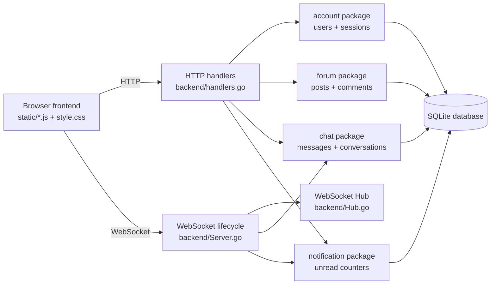
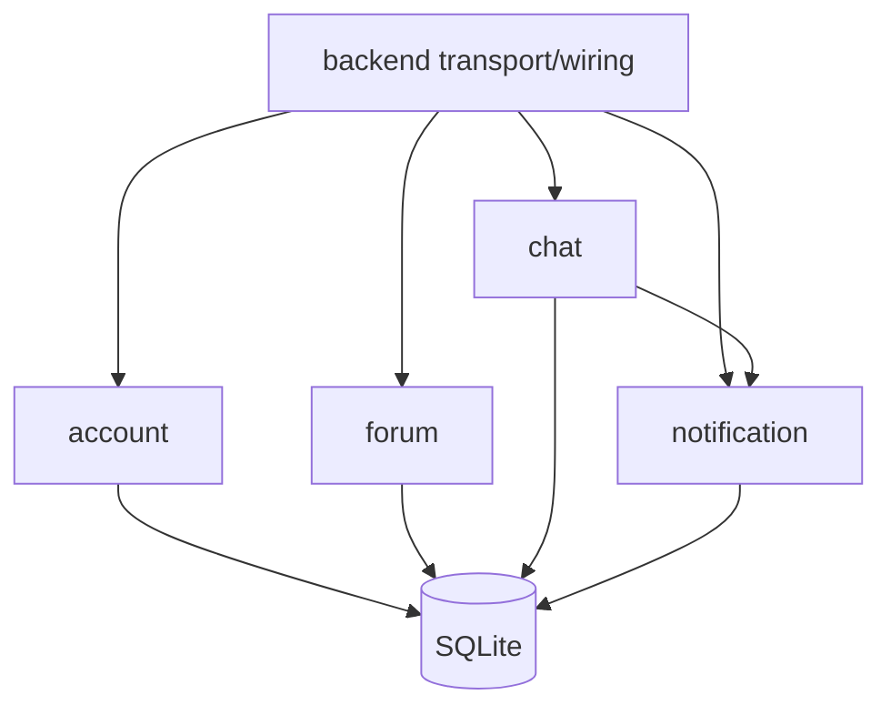
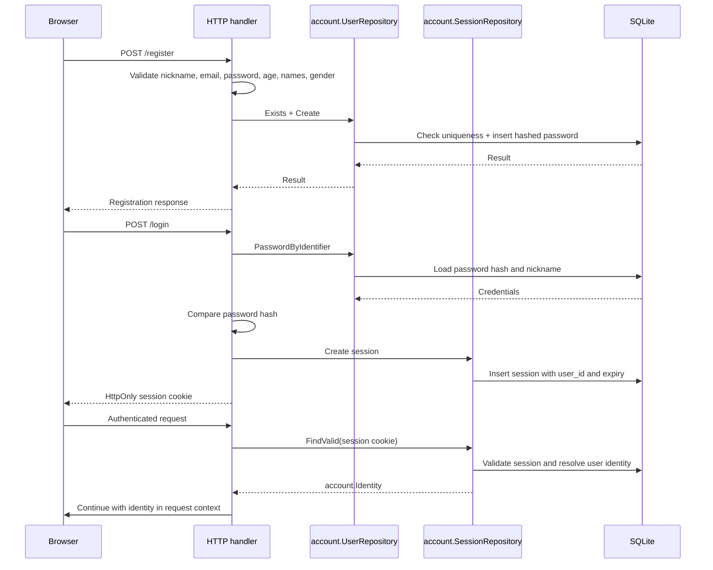
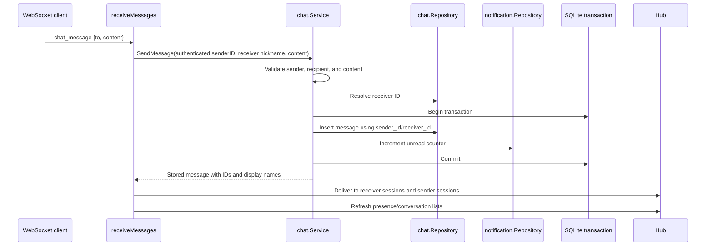
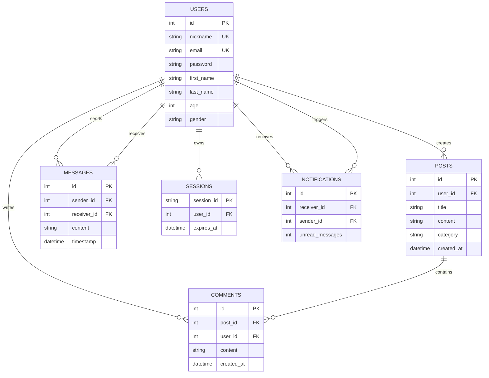

# Architecture

This document describes the current architecture of the Real-time Forum after the refactor and cleanup pass.

## System overview

The application is a small Go HTTP server with a static JavaScript frontend, SQLite persistence, and a WebSocket endpoint for real-time chat and presence updates.



## Package responsibilities

### Root `backend` package

The root package owns application wiring and transport orchestration:

- HTTP route registration and middleware.
- WebSocket upgrade and connection lifecycle.
- Mapping authenticated identities to transport clients.
- Routing WebSocket events to the chat service and Hub.
- Converting repository results into HTTP/WebSocket response shapes.

It should not contain feature-specific SQL or persistence rules.

### `backend/account`

Owns account and session persistence:

- `UserRepository`: user existence checks, account creation, and credential lookup.
- `SessionRepository`: create, validate, and delete sessions.
- `Identity`: authenticated `UserID`, nickname, and session ID passed through request context.

### `backend/forum`

Owns forum persistence:

- Creating and listing posts.
- Creating and listing comments.
- Post and comment data models.

### `backend/chat`

Owns chat persistence and business rules:

- Validating recipients and message content.
- Resolving recipient nicknames to user IDs.
- Persisting messages.
- Listing message history and conversation users.
- Coordinating message persistence with unread notification updates through one transaction.

### `backend/notification`

Owns unread notification persistence:

- Incrementing unread message counters.
- Listing unread counters by sender.
- Marking a sender conversation as read.

### `backend/migrations`

Contains the ordered SQLite migrations. Migrations `003` and `004` represent the identity migration from nickname relationships to user IDs. The current schema uses IDs for messages, sessions, and notifications.

## Dependency direction



The direction is intentionally simple:

- Handlers depend on repositories and services.
- `chat.Service` depends on `chat.Repository` and `notification.Repository` because sending a message updates both message history and unread state atomically.
- Repositories depend on `database/sql` and do not depend on HTTP or WebSocket code.
- Feature packages do not depend on the root `backend` package.

## Authentication and session flow



The authenticated identity is the source of truth. Client-provided sender identity is not trusted for protected operations.

## WebSocket Hub and client design

The Hub is keyed by `UserID`, not nickname:

```text
Hub
└── map[userID]map[connectionID]*Client
```

This supports multiple browser sessions for one user and avoids using mutable display data as an internal identity key.

Each `Client` owns:

- The WebSocket connection.
- The authenticated `UserID`, nickname, and session ID.
- A buffered outbound channel.
- Close synchronization to avoid closing the channel more than once.

Each connection has two goroutines:

- Reader: applies read limits, pong deadlines, parses incoming events, and delegates chat handling.
- Writer: serializes outbound messages and periodic ping frames with write deadlines.

The browser still receives nicknames in the existing message contract. IDs are used internally for Hub lookup, persistence, presence, and delivery.

## Message persistence and notification transaction



If message insertion or notification update fails, the transaction rolls back and no partial message state is committed.

Messages are stored as raw text and rendered by the frontend with `textContent`. This keeps storage separate from presentation escaping and avoids double-escaping history or live events.

## Data model

The current identity relationships are:



## Important boundaries

- HTTP handlers authenticate and validate transport input, then call a repository or service.
- `account.Identity` is used for authenticated user context.
- `chat.Service` is the only business entry point for sending a message.
- The Hub handles connection lookup and delivery, not database persistence.
- Repositories own SQL queries.
- SQLite migrations own schema changes; runtime code should not silently alter the schema.

## Verification commands

```bash
gofmt -l .
go test ./...
go test -race ./...
go vet ./...
go build .
```
